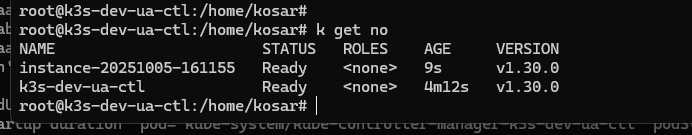

## On cloud node
```bash
# create init stuff from previous labs scripts such as containerd
# transfer kubeconfig from main node to /var/lib/kubelet/kubeconfig
# update server in kubeconfig
# transfer ca.crt to /var/lib/kubelet/ca.crt
# run containerd
PATH=$PATH:/opt/cni/bin:/usr/sbin /home/b_v_kosarevskyi/kubebuilder/bin/kubelet \
  --kubeconfig=/var/lib/kubelet/kubeconfig \
  --config=/var/lib/kubelet/config.yaml \
  --hostname-override=$(hostname) \
  --root-dir=/var/lib/kubelet \
  --v=2 &
```

## On main node
I was not able to make it working inside gh codespaces, so used old own server.
```bash
k ket no
```

